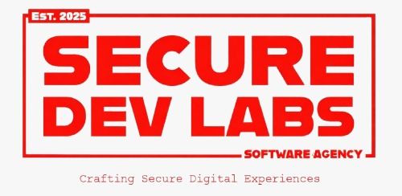
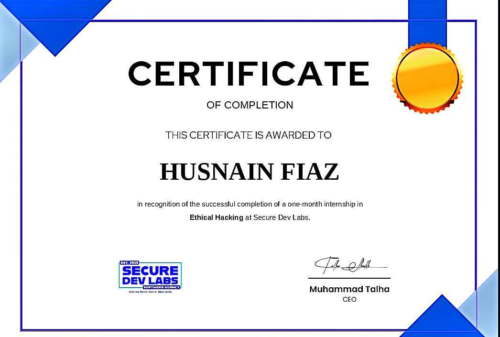

# SECURE DEV LAB | ETHICAL HACKING INTERNSHIP

Cyber notes from a one-month hands-on internship in a controlled lab.

**Intern:** Husnain Fiaz  
**Track:** Ethical Hacking  
**Duration:** 1 Month  
**Instructor:** Muhammad Saad Rajput  
**CEO:** Talha, Secure Dev Lab

---

## Mission Brief

This repository is a compact record of the internship journey at Secure Dev Lab. The work focused on reconnaissance, web mapping, vulnerability validation, and reporting inside a safe lab environment.

---

## Stack Cards

<table>
	<tr>
		<td align="center"> Attacking platform</td>
		<td align="center"> Lab virtualization</td>
	</tr>
	<tr>
		<td align="center"> Port and service discovery</td>
		<td align="center"> Exploitation framework</td>
	</tr>
	<tr>
		<td align="center"> Vulnerable target VM</td>
		<td align="center"> Notes and findings</td>
	</tr>
</table>

---

## Repository Layout

- [week-01-lab-setup-and-target-enumeration](./week-01-lab-setup-and-target-enumeration) - Environment setup and initial enumeration.
- [week-02-web-application-mapping-and-input-discovery](./week-02-web-application-mapping-and-input-discovery) - Web mapping and request discovery.
- [week-03-web-vulnerability-validation](./week-03-web-vulnerability-validation) - Vulnerability validation and testing.
- [week-04-mini-assessment-and-reporting](./week-04-mini-assessment-and-reporting) - Mini assessment, reporting, and exploit notes.
- [certificate](./certificate) - Internship completion certificate.

---

## Weekly Tasks

**Week 1** - Lab setup and target enumeration.

**Week 2** - Web application mapping and input discovery.

**Week 3** - Web vulnerability validation and proof-of-concept testing.

**Week 4** - Mini assessment, reporting, and final documentation.

---

## Weekly Posts

<table>
	<tr>
		<td align="center" valign="top" style="padding:12px; border:1px solid #263041; border-radius:12px;">
			<strong>Week 1</strong>  
			<iframe src="https://www.linkedin.com/embed/feed/update/urn:li:ugcPost:7452397121363943424?collapsed=1" height="320" width="504" frameborder="0" allowfullscreen="" title="Embedded post"></iframe>
		</td>
		<td align="center" valign="top" style="padding:12px; border:1px solid #263041; border-radius:12px;">
			<strong>Week 2</strong>  
			<iframe src="https://www.linkedin.com/embed/feed/update/urn:li:ugcPost:7456240338182230016?collapsed=1" height="320" width="504" frameborder="0" allowfullscreen="" title="Embedded post"></iframe>
		</td>
	</tr>
	<tr>
		<td align="center" valign="top" style="padding:12px; border:1px solid #263041; border-radius:12px;">
			<strong>Week 3</strong>  
			<iframe src="https://www.linkedin.com/embed/feed/update/urn:li:ugcPost:7458528165871677440?collapsed=1" height="320" width="504" frameborder="0" allowfullscreen="" title="Embedded post"></iframe>
		</td>
		<td align="center" valign="top" style="padding:12px; border:1px solid #263041; border-radius:12px;">
			<strong>Week 4</strong>  
			<iframe src="https://www.linkedin.com/embed/feed/update/urn:li:ugcPost:7461130145781964800?collapsed=1" height="320" width="504" frameborder="0" allowfullscreen="" title="Embedded post"></iframe>
		</td>
	</tr>
</table>

---

## What I Learned

- Small exposures can become full attack paths.
- Good enumeration matters more than rushing exploitation.
- Clear reporting is part of the security workflow.

---

## Certificate

<table align="center" border="1" cellpadding="14" cellspacing="0">
	<tr>
		<td align="center">
			
		</td>
	</tr>
</table>

*Internship Completion Certificate*

